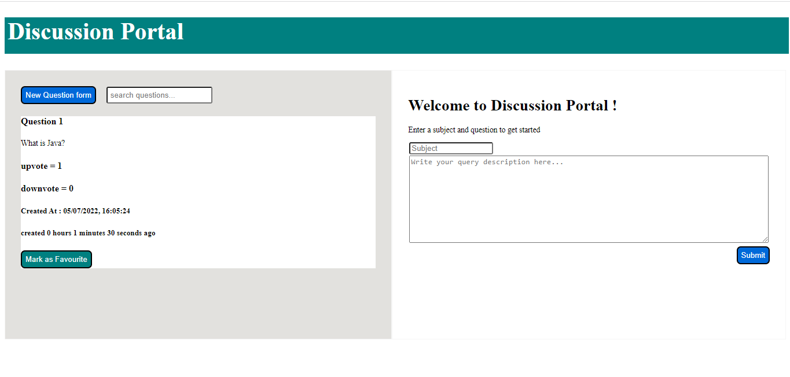
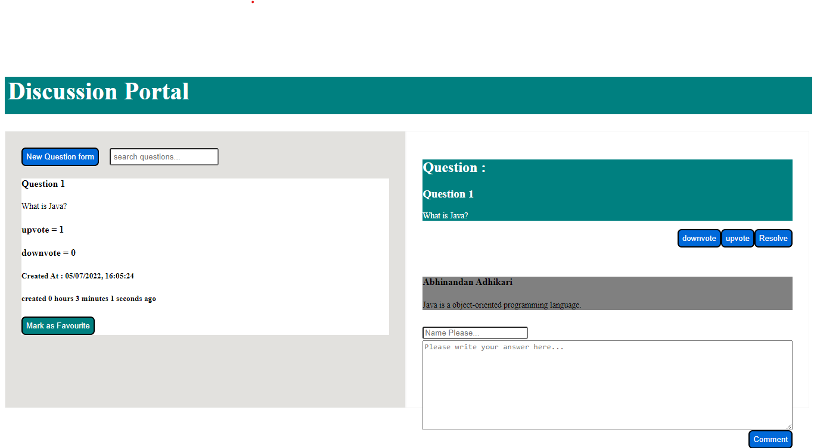

# Discussion App

- This is the front-end design of a discussion portal where users can ask questions, comment on the questions, upvote or downvote the questions, and resolve the questions.
- It doesn't make use of a database to store data, instead it makes use of the __browser's local storage__ to access and store the data.
- This project was built during [CodeQuotient's SuperCoders training program](https://codequotient.com/profile/AbhinandanAdhikari).

# How to use

- Users can raise any questions.
- Users can click on question to give the answers to questions.
- Users can upvote or downvote the questions.
- Users can resolve the questions.
- Users can mark the questions as favourite.

# Screenshot

## Front-end Design:

## Users have to click on the questions to answer it:

Hope you all liked it :heart:
